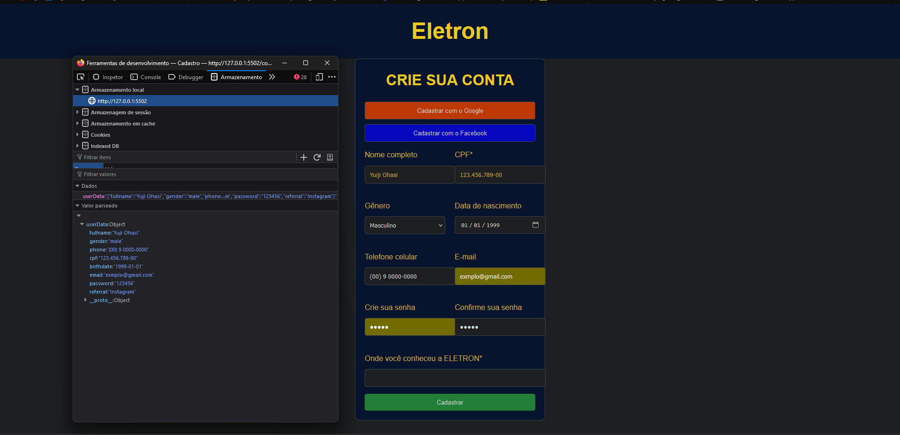
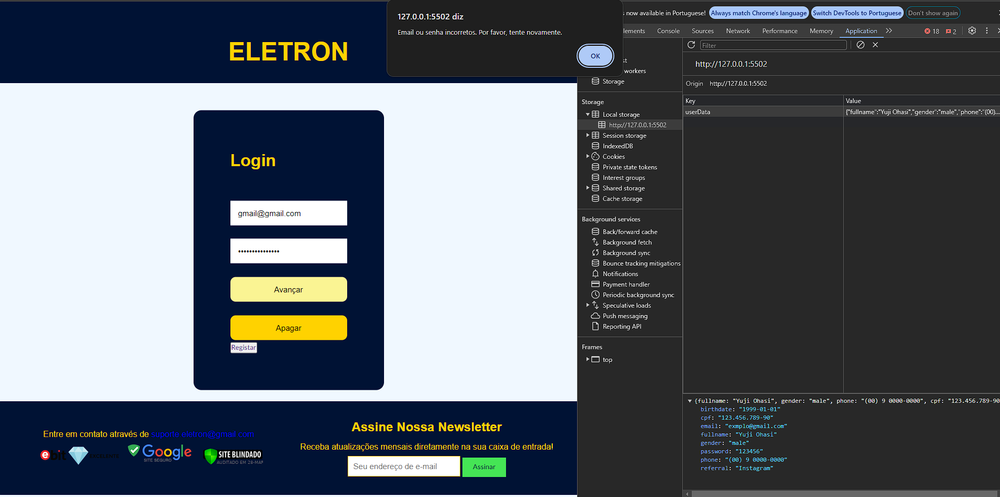
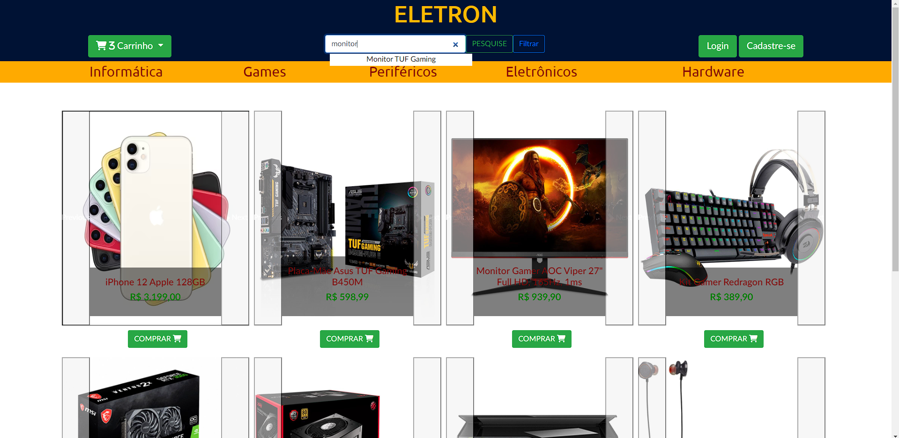
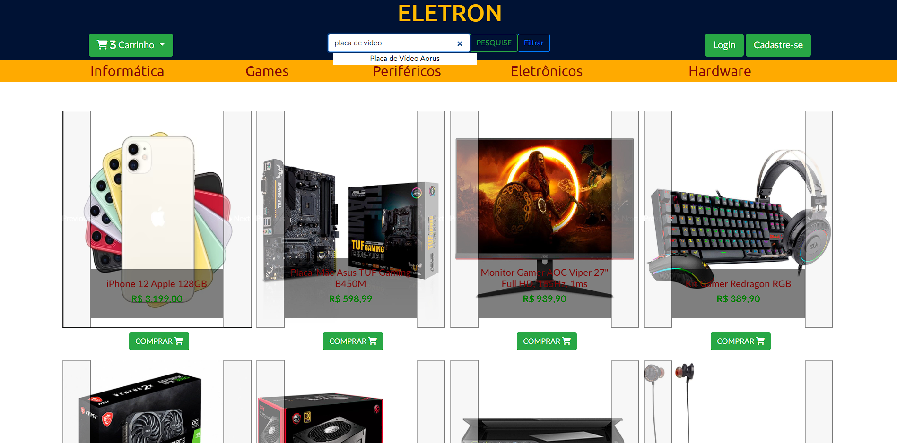
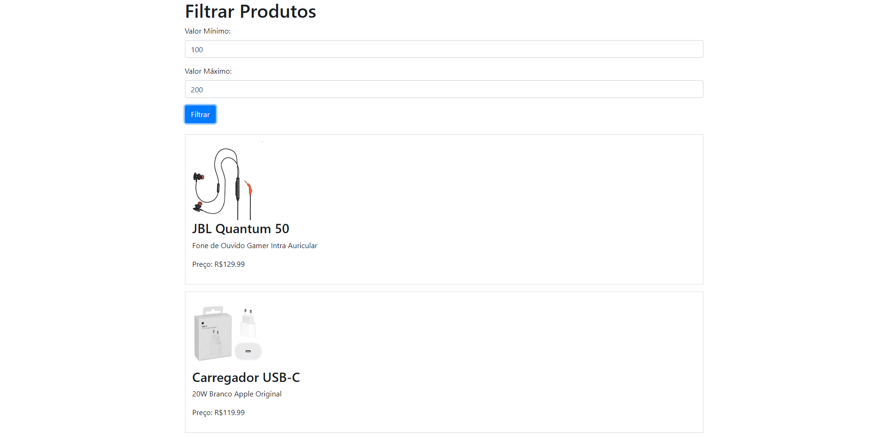
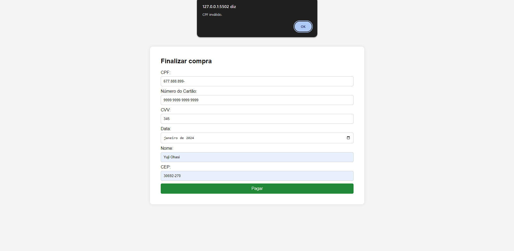
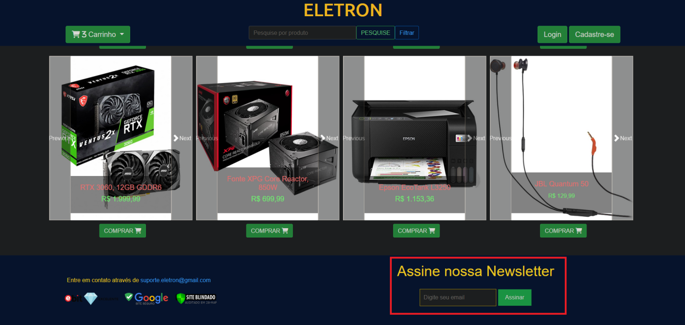
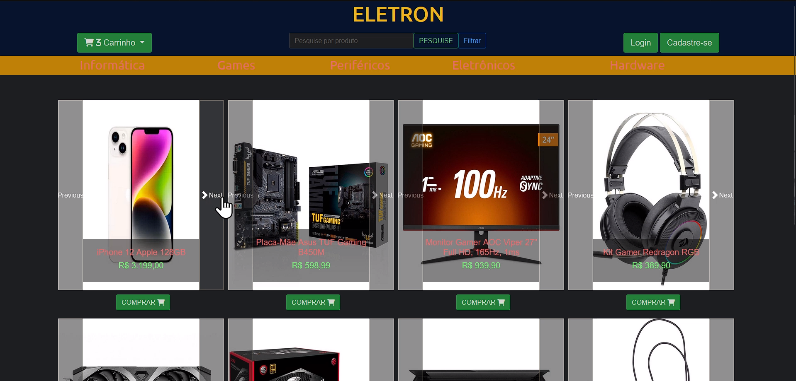
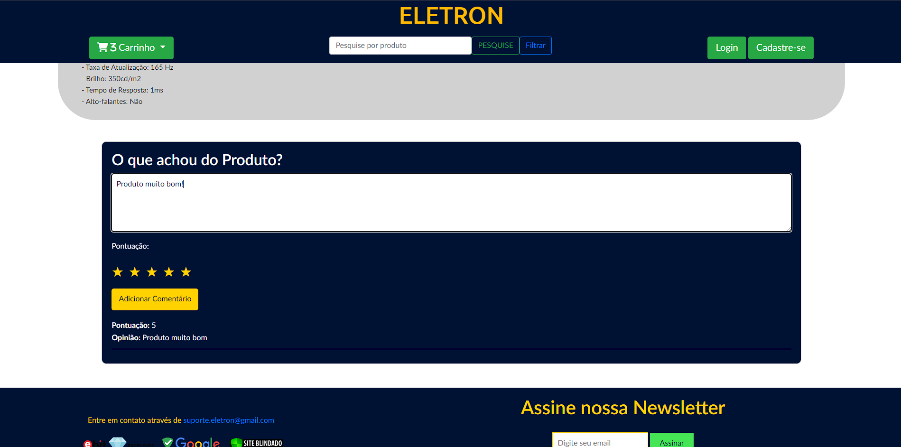
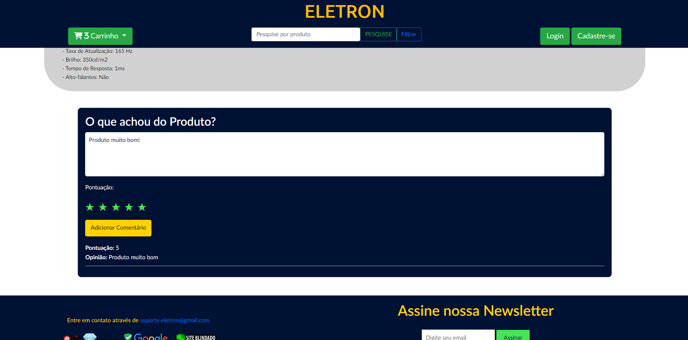

# Registro de Testes de Software / EDITAR

Pré-requisitos: <a href="https://github.com/ICEI-PUC-Minas-PMV-ADS/ads-e1-exemplo-vida-de-estudante/tree/main/documentos/04-Projeto%20de%20Interface.md"> Projeto de Interface</a>, <a href="https://github.com/ICEI-PUC-Minas-PMV-ADS/ads-e1-exemplo-vida-de-estudante/tree/main/documentos/08-Plano%20de%20Testes%20de%20Software.md"> Plano de Testes de Software</a>

Os testes funcionais realizados na aplicação web são descritos a seguir.

<ol>
  <li> CT-01: Verificar o funcionamento dos links da página Home.

  Responsável: Yuji Ohasi / Matheus Estrela.
  
  

  https://youtu.be/hsCBNBXfx3U

  </li>
  

  
  <li> CT-02: Login e Cadastro.

  Responsável: Yuji Ohasi.
    
  
Cadastro

    

  
Login

    

  
 No caso abaixo, os valores digitados não faziam parte das informações dadas pelo usuário. Assim, não foi possível autenticar

    

  </li>
  

  
  <li> CT-03: Autenticacao via API, Google ou Facebook.

Responsável: Matheus Estrela.

      https://youtu.be/MhphQRgbHjo?si=jM7K_GY8W2piTQoW

 E possivel entrar no site, com uma conta pre cadastrada, seja do facebook ou Google, com o fator de criptografia Oauth2 , ambas configuradas via Api's

  </li>

  

  
  <li> CT-04: Filtro de pesquisa.

Responsável: Gabriel / Arthur

 E possivel pesquisar qualquer produto na loja, estao alocados no catalogo em Json

  </li>
  

  
  <li> CT-05: Carrinho
   
  Responsável: Arthur / Matheus. 
   
   
No carrinho e possivel colocar os item desejados e concluir sua compra.

      

  </li>
  
    

    

  
  </li>
  

  
  <li> CT-06: Filtro de Valores.

  Responsável:  Vitor Hugo. 
  
   
Permite ao usuario definir um valor mínimo e máximo para encontrar algum produto desejado<

  
 
  
      (https://youtu.be/rgQf--UYxyY)

  </li>
  

  
  <li> CT-07: Finalizacao de Pagamento

  Responsável: Yuji Ohasi 
    
  
 Validação dos dados de pagamento inseridos pelo usuário 

  

  
 Bloqueio caso o número do cartão seja inválido 

  
  

  
 Bloqueio caso o número de CPF seja inválido 

  
  

  </li>
  

  
  <li> CT-08: NewsLetter.

  Responsável: Matheus Estrela. 
    
  
 Disparo de e-mail promocional para o usuário * o uso da Newsletter via Api, depende dos tokens Fornecidos pelo EmailJs, limitado ao plano Free **Validado pela o uso pela mentora Amalia em reuniao do grupo. 

  
   

        https://youtu.be/ruta06E0Ieg

  </li>
  

  
  <li> CT-09: Carrossel de produtos

  Responsável: Gabriel Nakazato
  

  

      https://youtu.be/91JbL59CXGk

  

  
  </ol>

  <li> CT-10: Avaliação de usuário

  Responsável: Arthur Isidório

  
 Ao final dos detalhes do produto, o usuário pode deixar uma avaliação, para isso foi disponibilizado este campo 

  
  

  
 O usuário escreve o seu comentário com base na sua avaliação sobre o produto

  

  
O usuário escolhe uma pontuação de 1-5 para avaliar o produto

  

  

  
  </ol>
    

## Avaliação

Os testes de software no site foram concluídos com sucesso, confirmando que os requisitos prioritários foram atendidos. As funcionalidades principais do software estão operando corretamente e atendendo às necessidades dos usuários.

O relatório de testes também menciona planos para futuras melhorias no layout e na responsividade da aplicação. Essa abordagem é considerada uma boa prática no desenvolvimento de software, pois permite que as equipes de engenharia se concentrem nas funcionalidades essenciais durante as fases iniciais, enquanto as melhorias estéticas e de usabilidade são adicionadas posteriormente.

